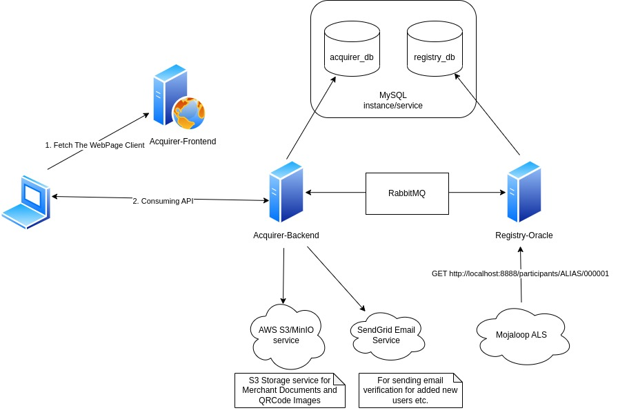

## Merchant Registry System

This repository is dedicated to the development of a merchant payment system
using Mojaloop for seamless merchant transactions. The system allows consumers
to pay merchants using mobile wallets with interoperability.

In this current phase, we are focused on implementing the acquiring system and
merchant registry, which will serve as an oracle in the payment process.

The Mojaloop's Account Lookup Service will interact with the merchant registry
and proceed with the necessary steps in the payment transaction.



##### For more information on Requirements, Diagrams, and User Stories

[Merchant Payment Documentation Repository](https://github.com/mojaloop/merchant-payment-docs/)

## Workspaces

* [Shared Library](./packages/shared-lib)
  * Usable Types, Enums, Methods etc..
* [Merchant Acquirer Backend Service](./packages/acquirer-backend)
  * Backend Service for handling Merchants Informations.
* [Merchant Acquirer Frontend](./packages/acquirer-frontend)
  * Portal for Hub Users, Makers, Checkers to manage and onboarding Merchants.
* [Merchant Registry Oracle](./packages/registry-oracle)
  * Will Serve as Oracle for Mojaloop ALS.

See the README.md file on each services for more Environment Variable Configuration options.

## Kubernetes Deployment with Helm Charts
* [Instruction README](./helms/README.md)

## Deploying on Docker
* Requirements
    - `docker` and `docker-compose`
    - [SendGrid](https://sendgrid.com/) API key is required for Email Verification 
        - Register at [SendGrid](https://sendgrid.com/) and create new API Key at https://app.sendgrid.com/settings/api_keys
        - Update the `SENDGRID_API_KEY` in the `./packages/acquirer-backend/.env` file with the new API Key obtained from https://app.sendgrid.com/settings/api_keys
        - Update the `SENDER_EMAIL` in the `./packages/acquirer-backend/.env`
    - reCAPTCHA Site Key and Secret Key is required for reCAPTCHA Verification
        - Register at [Google reCAPTCHA](https://www.google.com/recaptcha/admin/create) and create new reCAPTCHA v2 Checkbox
        - Use Client Site Key and Update the `VITE_RECAPTCHA_SITE_KEY` in the `./packages/acquirer-frontend/.env`
        - Use Server Site Key and Update the `RECAPTCHA_SECRET_KEY` in the `./packages/acquirer-backend/.env` 

* Run 
    ```bash 
    docker-compose up --build
    ```
    * Acquirer Frontend should be running at: http://localhost:5173
    * Acquirer Backend should be running at: http://localhost:5555/api/v1/health-check
        * Swagger API Doc should be at: http://localhost:5555/docs
    * Merchant Registry Backend should be running at: http://localhost:8888/health-check
        * Swagger API Doc should be at: http://localhost:8888/docs
    * MinIO S3 Compatible Storage Server is running at http://minio:9000 (Service).
        * To be able to access merchant license document file or QRCode Image, 
            * For Linux/Mac, open `/etc/hosts` with root permission and add this line `127.0.0.1 minio`, otherwise `minio:9000` link will be unreachable.

## For Deploying manual without Docker
* Check [Manual Deployment Guide](./docs/manual-deployment-guide.md)

## Running Testing
Require `docker-compose up minio rabbitmq` (MinIO and RabbitMQ) to be running.
* Run at the root of the project
    ```bash
    npm install
    npm run acquirer-backend:test:coverage
    ```

## ERD Design


## Note
The system utilize RabbitMQ for message queuing between services and SendGrid for email verification. 
Adopters can substitute these services with their preferred choices for a customized integration.
